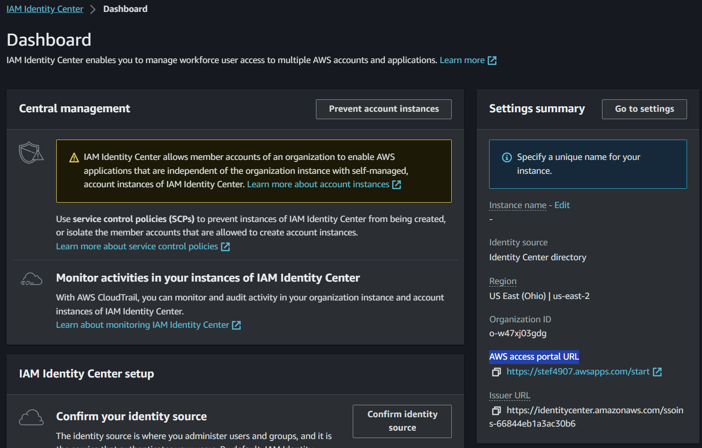
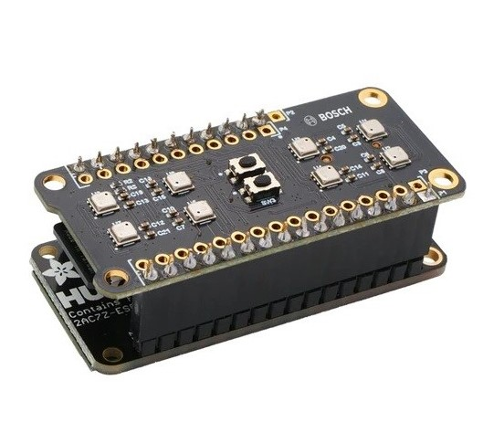

# Air Quality Monitoring Project

## Authors

Stefan Lukic  
Filip Lukic  
Pranav Hari

## File Structure  

- `MonitoringKit`: Code for Monitoring Stations  
  - `Monitoring_Breakout`: Code for single breakout BME 688 sensor  
  - `Monitoring_X8`: Code for development board with 8x BME688
- `air-quality-sst`: AWS Infrastructure. Contains backend code and frontend web app.  
- `docs`: Relevant datasheets and documentation
- `images`: Image files
- `examples`: Code examples  

## Setup

### Creating AWS Infrastructure

1. Create AWS account
See the [AWS Docs here](https://docs.aws.amazon.com/accounts/latest/reference/manage-acct-creating.html) to create an account.

2. Setup IAM Access
Follow the [AWS documentation here](https://docs.aws.amazon.com/singlesignon/latest/userguide/get-started-prereqs-considerations.html) to use the AWS IAM Center to create an AWS access portal.

3. Once AWS IAM Center has been correctly configured, you should be able to login to your AWS account using your AWS access portal URL, which can be found in the IAM Center dashboard.

### SST Setup

SST is a framework that allows the creation of serverless infrastructure using code. To get started, read the documentation [here](https://docs.sst.dev/start/standalone).  See the readme file in `air-quality-sst` for more information.
Note that SST using the AWS CLI for authetication. See the AWS documentation [here](https://docs.aws.amazon.com/cli/latest/userguide/sso-configure-profile-token.html) for instructions on configuring the AWS CLI.  

### Setup AWS IOT Core

How2Electronics has a great [guide](https://how2electronics.com/connecting-esp32-to-amazon-aws-iot-core-using-mqtt/) on how to setup an ESP32 with AWS IOT Core.  

At a high level, you must enable the AWS IOT Core MQTT broker and download the device certificate, device private key, and the Amazon root CA certificate.  
These files can then be used to connect the ESP32 to AWS and publish and subscribe to channels as needed.  

### Monitoring Kit Hardware

#### Single Sensor

The current single sensor prototype of the monitoring kit utilizes a Huzzah ESP32 connected to a BME688 sensor using I2C.
Two LEDs are also used to indicate the WIFI and MQTT broker connection status.

Sensor data is periodically encoded into a JSON format, which is then published to a topic by sending the JSON to AWS IOT Core.  

#### Dev Board

The Dev board utilizes eight BME688 sensors connected to the stacked headers of the ESP32.  
Sensor data from each sensor is logged periodically and eventually sent to IoT core.  

